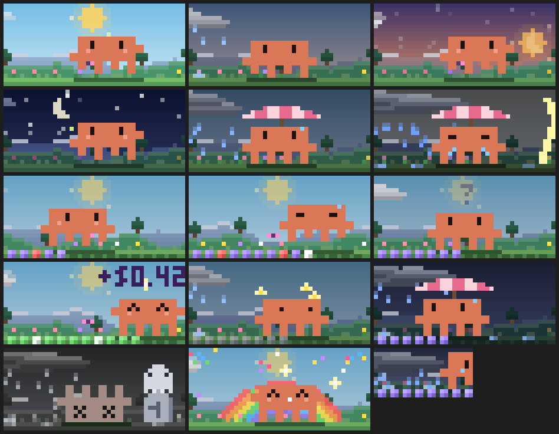

# ☁️ clawd-mods

Quatro mods pro [Claude Code](https://claude.com/claude-code). O principal é o **cloud-pet**: um Clawd de pixel art que mora em cima do seu prompt, vive o clima do seu contexto e anda numa barrinha enquanto o agente trabalha.



> Feito pra uso próprio, testado em Windows no app desktop e no terminal. Mods são um recurso novo do Claude Code; a API pode mudar.

## 🐾 cloud-pet

O Clawd fica numa faixa acima do prompt, com um painel de números do lado.

### O céu é o seu contexto
- **Clima = quanto do contexto já foi usado.** Céu limpo no começo, nuvens juntando, chuva, e tempestade com raio quando o auto-compact está chegando. Ele abre um guarda-chuva sozinho.
- **O limite é o seu de verdade.** O mod lê o limiar de auto-compact da sessão (respeita `autoCompactWindow`), não um 200k fixo. O HUD mostra tokens contra a janela (`250k`); o auto-compact dispara uma reserva antes (~217k), e é isso que a linha `auto-compact em ~X` conta.
- **Chuva só cai de nuvem.** Com vento, respingo e pocinha no chão.
- **Compactou?** Arco-íris, confete e o Clawd comemora.

### O mundo
- **Hora do dia real**: amanhecer, dia, pôr do sol e noite seguem o seu relógio. Sol, lua crescente, estrelas, vagalumes à noite e borboleta de dia.
- **Parallax em 4 camadas**: montanhas com neve, colinas com pinheiros, grama e flores. Tudo desliza enquanto ele trabalha.
- **Flores crescem** com os turnos que você fez no dia (até 8).

### Task bar
O Clawd é o marcador de uma barra de progresso desenhada no chão.

| Acontece | O Clawd |
|---|---|
| turno rodando | anda pra direita deixando quadradinhos roxos |
| tool deu erro | tropeça, o quadrado fica vermelho |
| 45s sem nenhum passo | para, olha pra trás e sua |
| o agente te fez uma pergunta | acena com um `?` em cima da cabeça |
| turno terminou | trilha fica verde, estrelinhas, custo flutua (`+$0.42`) |
| turno interrompido ou caiu | trilha cinza, ele fica tonto |

O progresso é **estimado**: nenhum turno diz quanto falta, então a barra usa passos + tempo contra a sua média de passos por turno (aprendida e salva). Ela para em ~93% até o turno acabar de verdade.

### O que o HUD fala
A primeira linha conta o que o agente está fazendo agora:

```
▶ Rodando os testes da api · 3m10      trabalhando (descrição da própria tool)
▶ editando scene.ts · 40s              Read / Edit / Write mostram o arquivo
▶ buscando autoCompact · 12s           Grep / Glob mostram o padrão
⏳ Build do worker há 1m00 · 4m20       sem passo novo há um tempo
✋ esperando você responder…           o agente te perguntou algo
✓ pronto em 4min · +$0.42              terminou
✗ interrompido                         você parou o turno
```

O texto vem dos argumentos da chamada de tool (o campo `description` que o agente já escreve). Não gasta token nenhum.

As outras linhas:

Em três blocos (status, sessão, conta), separados por linha em branco quando há altura:

```
contexto   ▰▰▰▱▱▱▱▱▱▱ 70k/250k
  auto-compact em ~147k · 2× hoje
cache      ▰▰▰▰▰▰▰▱▱▱ 42min

energia 5h ♥♥♥♡♡ 34% · reseta em 2h45
semana     ▰▱▱▱▱▱▱▱▱▱ 5%
custo      $0.43 · hoje $1.80
  último   +$0.12 · 5h +2.0% · sem +0.3%
```

- **Cache** = contagem de 60 min do cache de prompt, renovada a cada passo do agente. Com ≤10 min avisa `⚠ esfria logo`; com ≤5 min toast; ao expirar mostra quantos tokens a próxima mensagem vai reler e sugere compactar ou `/clear`. Ajuste `CACHE_TTL` em `scene.ts` se sua conta usar o cache de 5 min.
- **Energia** = seu limite de 5h. Se ele acabar (ou o da semana), o Clawd morre e vira lápide. x_x
- **Sentinela**: se no ritmo dos últimos 20 minutos o limite de 5h vai acabar antes do reset, aparece `⚠ acaba em ~35min` e um aviso quando faltar menos de 20.
- **Linha `último`**: o que o último turno gastou em dólar e em pontos da quota de 5h e da semanal (a quota é da conta: outras sessões rodando junto entram na conta).

### O que o Clawd fala
Clique nele (no terminal):

- cutucão: `hihi!`, `cosquinhas!`, `ai!`, `mais um! 💕`, `tô com fome de token…`, `bora codar?`
- 6 cutucões seguidos: `tonto… tonto…`
- clique no céu: `trovão! ⚡` (cai um raio onde você clicou)
- clique nele morto: `x_x…`

Os olhos seguem o mouse.

### Clawd te chama
- Toca um sininho e mostra um aviso quando um turno de **2 minutos ou mais** termina.
- Bate na porta (três notas) quando uma pergunta fica **15s** sem resposta.
- O som é gerado no próprio código, sem arquivo de áudio. Se o sistema não tocar, ele tenta a voz do sistema; se também não der, fica quieto.

### Diário
Guarda por dia: turnos, tempo, custo, compactações e mortes (últimos 30 dias).

### Comandos
| Comando | Faz |
|---|---|
| `/pet` | esconde / mostra |
| `/pet som` | liga / desliga o som |
| `/pet stats` | diário dos últimos 7 dias |
| `/pet fuso -3` | acerta o fuso do céu, se a hora estiver errada |

## 🛡️ native-guard

Recusa edição de arquivo feita pelo shell e manda o agente usar as tools certas (Edit e Write), que mostram diff e exigem ler o arquivo antes.

Bloqueia: `sed -i`, heredoc gravando arquivo (`cat > f <<EOF`, `tee f <<EOF`), python gravando arquivo e `Set-Content` / `Add-Content` / `Out-File`.

- Escape: colocar o comentário `# guard:ok` no comando.
- `/guard` liga e desliga.
- `bun native-guard/hooks/check.ts` roda os 16 casos de teste das regras.

## 🤝 handoff

`/handoff [foco]` resume a sessão num prompt pronto pra colar numa sessão nova (objetivo, estado, arquivos, decisões, armadilhas, próximo passo) e copia pro clipboard. Usa uma chamada de modelo sobre a própria conversa.

## 📋 session-board

`/board` abre um painel com todas as sessões do Claude Code abertas na máquina e o estado de cada uma: `▶ rodando`, `✋ esperando você`, `✓ pronto`.

Cada sessão escreve um arquivinho próprio em `~/.claude/session-board/` a cada 15s; sessão sem sinal há 1 minuto some da lista.

## Instalar

Clone e aponte o Claude Code pras pastas em `~/.claude/settings.json`:

```json
{
  "env": {
    "CLAUDE_CODE_PLUGIN_DIRS": "/caminho/clawd-mods/cloud-pet:/caminho/clawd-mods/native-guard:/caminho/clawd-mods/handoff:/caminho/clawd-mods/session-board"
  }
}
```

No Windows o separador é `;` em vez de `:`. Pode usar só os que quiser. Reinicie o Claude Code.

Pra testar um só, sem mexer em settings:

```bash
claude --plugin-dir /caminho/clawd-mods/cloud-pet
```

## Bom saber

- **Rede**: o cloud-pet consulta `api.anthropic.com/api/oauth/usage` com a credencial da própria sessão pra ler os limites de 5h e da semana. É um endpoint não documentado; se ele mudar, a energia cai pros números que a sessão já tem. Nenhum outro mod acessa a rede.
- **Dados**: tudo fica local (o diário no armazenamento do plugin, o board em `~/.claude/session-board/`). O board guarda os primeiros 60 caracteres do seu último prompt.
- **Sem evento de permissão**: quando o Claude Code pede autorização pra uma tool, o HUD não sabe; só perguntas do agente viram `✋`.
- **Verificado**: `claude plugin validate` nos quatro e `claude plugin test cloud-pet` (4 testes). Som no Windows ainda não foi confirmado.

## Desenvolver

```bash
claude plugin validate cloud-pet
```

```bash
claude plugin test cloud-pet
```

A cena inteira é desenhada em [cloud-pet/hooks/scene.ts](cloud-pet/hooks/scene.ts) (função pura: estado entra, pixels saem); o estado e os hooks estão em [cloud-pet/hooks/register.tsx](cloud-pet/hooks/register.tsx).
